Title: Introduction to Balanced Box-Decomposition Trees
Date: 2019-04-17 19:11
Category: code
Tags: code, crystal, math, machine learning
Thumb: https://ruivieira.github.io/images/bbdtrees/gaussian_filtering_clusters.png

Stardate 96893.29. You are the USS Euler's Science Officer at a moment when the computer graphical displays and voice systems went down. You only have enough deuterium for a short travel and need to find the nearest star system. This is not a simple matter of looking at a chart. You have multiple dimensions in which you can travel. In a bid for galactic peace, the Federation mandated that _both_ Emacs and Vim should be installed in all computers. You open your favourite editor and, fortunately, know exactly how to formulate the solution to your problem: a $d$-dimensional nearest neighbour algorithm.

Given a dataset $\mathcal{D}$ of $n$ points in a space $X$ we want to be able to tell which are the _closest_ point to a query point $q \in X$, preferably in a way which is computationally cheaper than _brute force_ methods (_e.g._ iterating through all of the points) which typically solve this problem in $\mathcal{O}(dn)$ [[Arya1998](#ref-1)]. $X$ could have $d$ dimensions (that is $\mathcal{D} \subset X : \mathbb{R}^d$) and we define _closest_ using1 Minkowski distance metrics, that is:

$$L_m = \left(\sum_{i=1}^d |p_i - q_i|^m\right)^{\frac{1}{m}},\qquad p,q \in X : \mathbb{R}^d.$$

A potential solution for this problem would be to use _kd_-trees, which for low dimenson scenarios provide $\mathcal{O}(\log n)$ query times [[Friedman1977](#ref-2)]. However, as the number of dimensions increase (as quickly as $d>2$) the query times also increase as $2^d$.

The case can be made then for _approximate_ nearest neighbour (NN) algorithms and that's precisely what we will discuss here, namely the _Balanced Box-Decomposition Tree_ (BBD, [[Arya1998](#ref-1)]). The definition of _approximate_ NN for a query point $q$ can be given as

$$\text{dist}(p, q) \leq (1+\epsilon)\text{dist}(p^{\star},q),\qquad \epsilon > 0,$$

where $p$ is the _approximate_ NN and $p^{\star}$ is the _true_ NN. Let's consider, for the sake of visualisation, a small two dimensional dataset $\mathcal{D} \to \mathbb{R}^2$ as shown in Figure 1.

<figure>
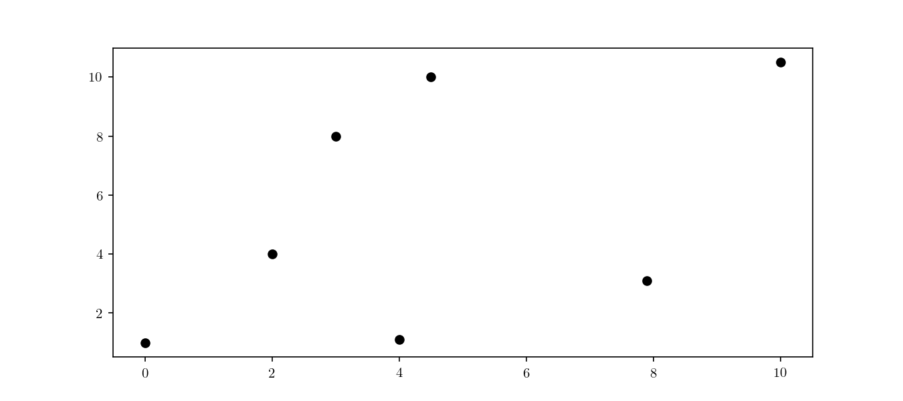
<figcaption><b>Figure 1.</b> A small test dataset in \(\mathbb{R}^2, n=7\).</figcaption>
</figure>

## Space decomposition

BBD trees belong to the category of hierarchical space decomposition trees. In BBD trees, specifically, space is divided in $d$-dimensional rectangles and _cells_. Cells can either represent another $d$-dimensional rectangle or the intersection of two rectangles (one, the _outer box_ fully enclosing the other, the _inner box_). Another important distinction of BBD trees is that rectangle's _size_ (in this context, the largest length in all of the $d$ dimensions) is bounded by a constant value.
The space decomposition must follow an additional rule which is boxes must be _sticky_. If we consider a inner box $[x_{inner}, y_{inner}]$ contained in a outer box $[x_{outer}, y_{outer}]$, such that

$$[x_{inner}, y_{inner}] \subseteq [x_{outer}, y_{outer}],$$

then, considering $w = y_{inner} - x_{inner}$, the box is considered _sticky_ if either

$$\begin{aligned}
x_{inner}-x_{outer} = 0 &\lor x_{inner}-x_{outer} \nleq w \\
y_{outer}-y_{inner} = 0 &\lor y_{outer}-y_{inner} \nleq w.
\end{aligned}$$ 

An illustration of the _stickiness_ concept can viewed in the diagram below.

<figure>
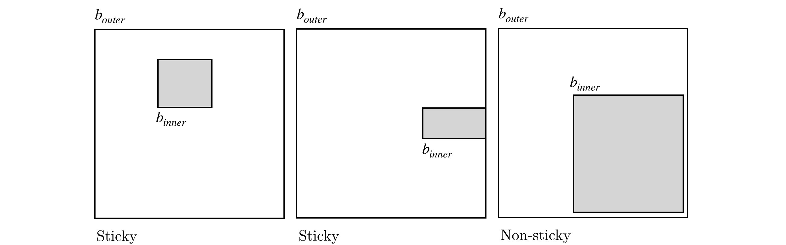
<figcaption><b>Figure 2.</b> Visualisation of the "stickiness" criteria for \(\mathbb{R}^2\) rectangles.</figcaption>
</figure>

Stickiness provides some important geometric properties to the space decomposition which will be discussed further on. The actual process of space decomposition will produce a tree of nodes, each with an associated $d$-dimensional rectangle enclosing a set of points. Each node will be further decomposed into children nodes, containing a region of space with a subset of the parent's data points. If a node has no children it will be called a _leaf_ node. The division process can occur either by means of:

* a _fair split_, this is done by partitioning the space with an hyperplane, resulting in a _low_ and _high_ children nodes
* a _shrink_, splitting the box into a inner box (the _inner_ child) and a outer box (the _outer_ child).

<figure>
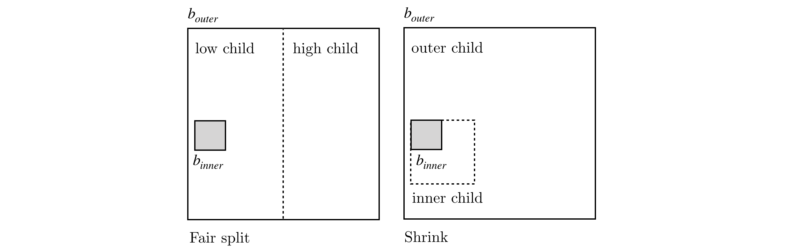
  <figcaption><b>Figure 3.</b> "Fair split" and "shrinking" division strategies example in \(\mathbb{R}^2\) with respective high/low and outer/inner children.</figcaption>
</figure>

The initial node of the tree, the _root node_, will include all the dataset points,  $\mathcal{D}$. In the Figure 4 we can see a representation of the root node for the dataset presented above. We can see the node boundaries in dashed red lines as well as the node's center, marked as $\mu_{root}$.

<figure>
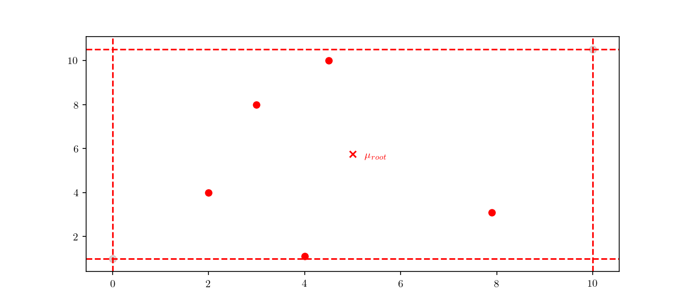
  <figcaption><b>Figure 4.</b> Associated cell for the BBD-tree root node for the example dataset. Node boundaries in red and node centre labelled as \(\mu_{root}\).</figcaption>
</figure>

The actual method to calculate the division can either be based on the _midpoint algorithm_ or the _middle interval algorithm_. The method used for these examples is the latter, for which more details can be found in [[Kosaraju1995](#ref-4)].  The next step is to divide the space according to the previously mentioned rules. As an example, we can see the root node's respective children in Figure 5.

<figure>
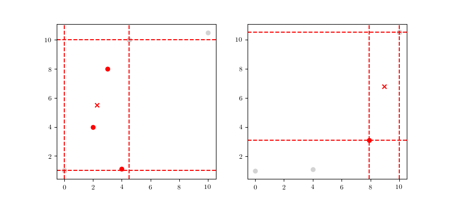
<figcaption><b>Figure 5.</b> BBD-tree root node's lower (<i>left</i>) and upper (<i>right</i>) children. Node boundaries in red and centres labelled with a red cross.</figcaption>
</figure>

This process is repeated until the child nodes are leaves and cannot be divided anymore. 

To better visualise the construction process it would be helpful to have a larger tree, so we will now consider still the 2-dimensional case, but now with a larger dataset (Figure 6), consisting of 2000 samples in total, each half from a bivariate Gaussian distribution:

$$\begin{aligned}
\text{X}_1 &\sim \mathcal{N}([0,0], \mathbf{I}) \\
\text{X}_2 &\sim \mathcal{N}([3, 3], \mathbf{I}). \\
\end{aligned}$$

<figure>
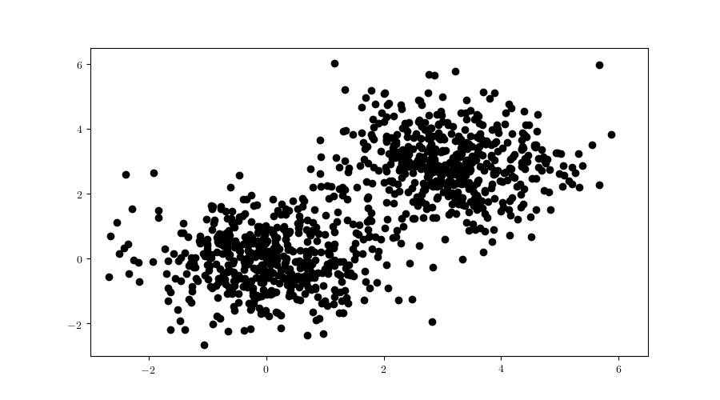
<figcaption><b>Figure 6.</b> Larger example dataset in \(\mathbb{R}^2\) consisting of a realisation of \(n=2000\) from two bivariate Gaussian distributions centred in \(\mu_1=(0,0)\) and \(\mu_2=(3,3)\) and with \(\Sigma=\mathbf{I}\).</figcaption>
</figure>

With this larger dataset, we have enough points to illustrate the tree node building. This time, we will start from the root node and always follow either the "lower" nodes or the "upper" nodes (as show in Figure 7). We can clearly see the cells getting smaller, until finally we have a single point included (*i.e.* a _leaf_ node).

<figure>
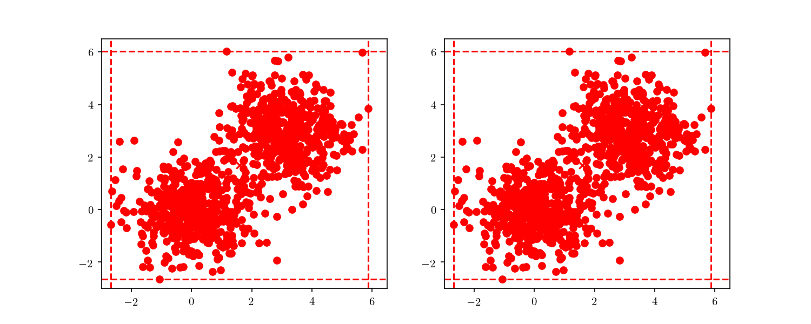
  <figcaption><b>Figure 7.</b> BBD-tree node building process for the bivariate dataset. On the left we traverse the upper tree nodes and on the right the lower tree nodes.</figcaption>
</figure>

This division process illustrates an important property of BBD-trees. Although other space decomposition algorithms (such as _kd_-trees) display a geometric reduction of number of points enclosed in each _cell_, methods such as the BBD-tree, which impose constraints on the cell's size aspect ratio as stated before, display not only a geometric reduction in the number of points, but also in the cell's size as well. The construction cost of a BBD-tree is $\mathcal{O}(dn \log n)$ and the tree itself will have $\mathcal{O}(n)$ nodes and $\mathcal{O}(\log n)$ height.

## Tree querying

Now that we have successfully constructed a BBD-tree, we want to actually find the (approximate) nearest neighbour of an arbitrary query point $q$ (Figure 8).

<figure>
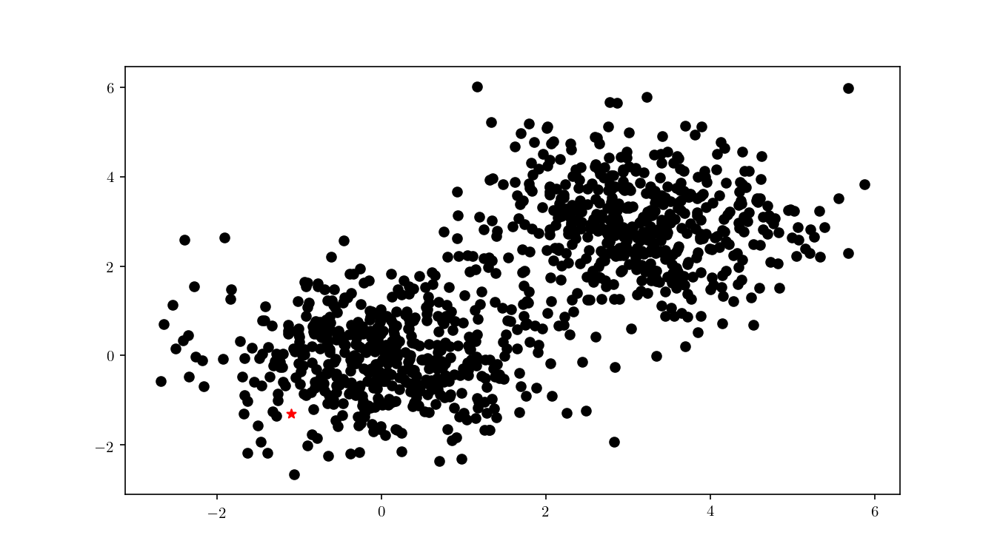
  <figcaption><b>Figure 8.</b> Query point \(q\) (red) for the bivariate dataset.</figcaption>
</figure>

The first step consists in descending the tree in order to locate the smallest cell containing the query point $q$. This process is illustrated for the bivariate data in Figure 9.

<figure>
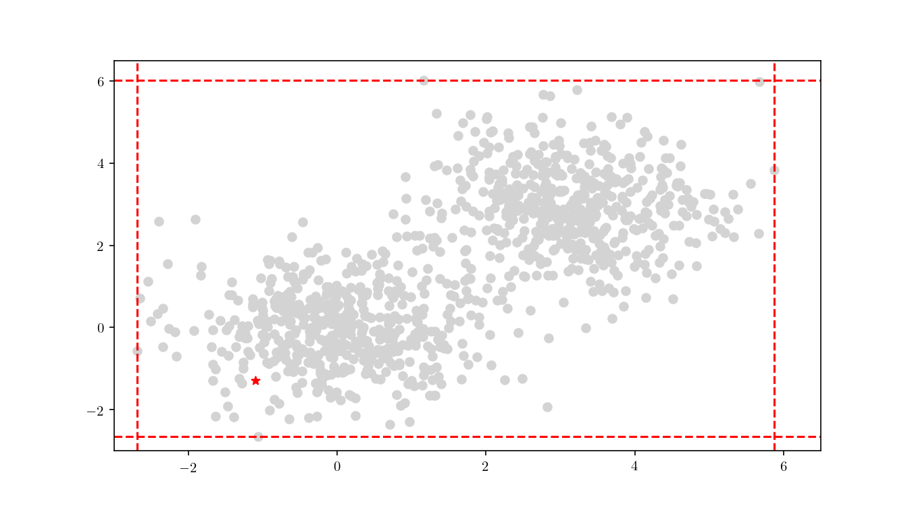
  <figcaption><b>Figure 9.</b> BBD-tree descent to locate the smallest cell containing \(q\) (red).</figcaption>
</figure>

Once the cell has been located, we proceed to enumerate all the _leaf_ nodes contained by it and calculate our distance metric ($L_2$ in this case) between the query point $q$ and the leaf nodes, eventually declaring the point with the smallest $L_2$ as the aproximate NN. BBD-trees provide strong guarantees that the ANN will be located within this cell and not in a neighbouring cell. In Figure 10 we zoomed in the smallest cell containing $q$ and show the associated calculated $L_2$ distance for each node.

<figure>
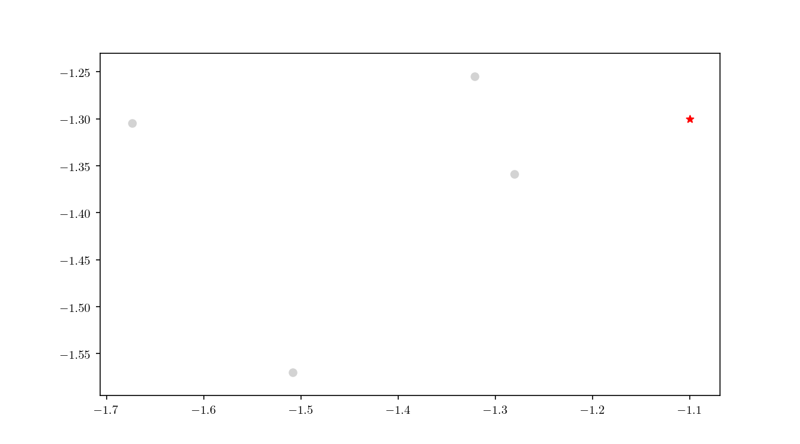
  <figcaption><b>Figure 10.</b> \(L_2\) distance between leaf nodes and the query point \(q\) inside the smallest cell containing \(q\).</figcaption>
</figure>

An important property of BBD-trees is that the tree structure does not need to be recalculated if we change either $\epsilon$ or if we decide to use another $L_m$ distance metric [[Arya1998](#ref-1)]. The query time for a point $q$ in a BBD-tree is $\mathcal{O}(\log n)$. For comparison, if you recall, the query time for a _brute force_ method is typically $\mathcal{O}(dn)$.

## Filtering and _k_-NN

Great. Now that you solved the USS Euler's problem, you want to make a suggestion to the federation. Where to place several star-bases and how to divide the system's coverage between them. An immediate generalisation of this method is easily applicable to the problem of _clustering_. Note that, at the moment, we are not concerned with determining the "best" clusters for our data2. Given a set of points $Z = \{z_1, z_2, \dots, z_n\}$, we are concerned now in partitioning the data in clusters centred in each of the $Z$ points. A way of looking at this, is that we are building, for each point $z_n$ a Voronoi cell $V(z_n)$. This is achieved by a method called _filtering_. Filtering, in general terms, works by walking the tree with the list of _candidate centres_ ($Z$) and pruning points from the candidate list as we move down. We will denote an arbitrary node as $n$, $z^{\star}_w$ and $n_w$ respectively as the candidate and the node weight, $z^{\star}_n$ and $n_n$ as the candidate and node count. The algorithm steps, as detailed in [[Kanungo2002](#ref-3)], are detailed below:

Filter($n$, $Z$) { 
 $\qquad C \leftarrow n.cell$ 
 $\qquad$**if** ($n$ is a leaf) { 
$\qquad\qquad z^{\star} \leftarrow$ the closest point in $Z$ to $n.point$ 
 $\qquad\qquad z^{\star}_w \leftarrow z^{\star}_w + n.point$ 
$\qquad\qquad z^{\star}_n \leftarrow z^{\star}_n + 1$ $\qquad$} **else** { 
 $\qquad\qquad z^{\star} \leftarrow$ the closest point in $Z$ to $C$'s midpoint 

$\qquad\qquad$**for each** ($z \in Z \setminus \{z^{\star}\}$) { $\qquad\qquad\qquad$**if** ($z.isFarther(z^{\star},C)$) { $\qquad\qquad\qquad\qquad Z \leftarrow Z \setminus \{z\}$ $\qquad\qquad\qquad$} 
$\qquad\qquad$} 
$\qquad\qquad$**if** ($|Z|=1$) { 
$\qquad\qquad\qquad z^{\star}_w \leftarrow z^{\star}_w + n_w$ 
$\qquad\qquad\qquad z^{\star}_n \leftarrow z^{\star}_n + n_n$ 
$\qquad\qquad$} **else** { $\qquad\qquad\qquad$Filter($n_{left}, Z$) 
$\qquad\qquad\qquad$Filter($n_{right}, Z$) $\qquad\qquad$} 
} 

To illustrate the assignment of data points to the centres, we will consider the previous bivariate Gaussian data along with two centres, $z_1 = \{0,0\}$ and $z_2 = \{3, 3\}$. Figure 11 shows the process of splitting the dataset $\mathcal{D}$ into two clusters, namely the subsets of data points closer to $z_1$ or $z_2$.

<figure>
  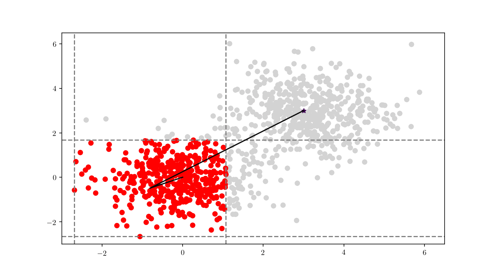
  <figcaption><b>Figure 11.</b> Assignment of points in \(\mathcal{D}\) to \(Z\). Data points coloured according to the assigned center. Lines represent the distance from the cells midpoint to \(Z\).</figcaption>
</figure>

We can see in Figure 12 the final cluster assignment of the data points. With a $\mathbb{R}^2$ dataset and only two centres the organisation of points follows a simple perpendicular bisection of the segment connecting the centres, as expected.

<figure>
	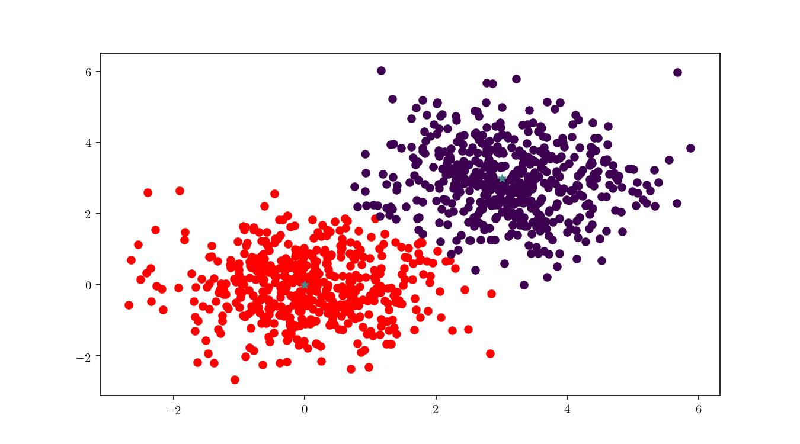
  <figcaption><b>Figure 12.</b> Final \(\mathcal{D}\) point assignment to clusters centred in \(z_1\) and \(z_2\).</figcaption>
</figure>

In Figure 13 we can see more clearly the dataset clusters changing when center $z_1$ is moving around the plane. BBD-trees can play an important role in improving _k_-means performance, as described in [[Kanungo2002](#ref-3)].

<figure>
  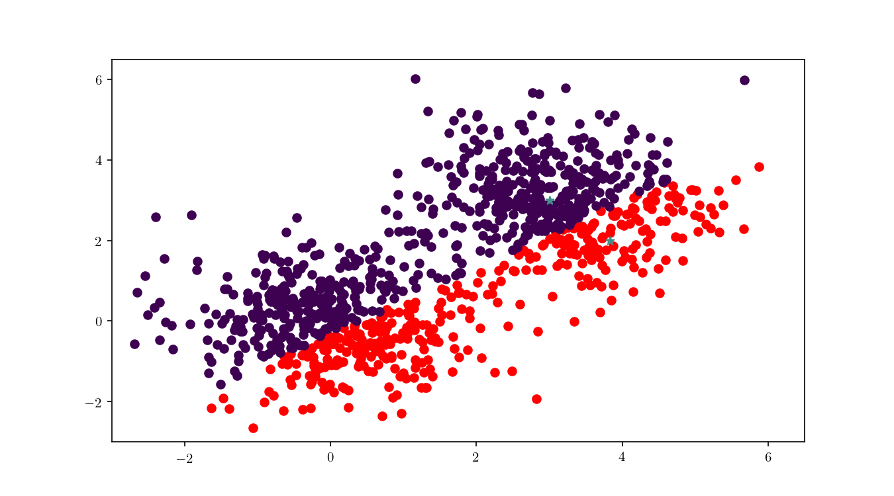
  <figcaption><b>Figure 13.</b> Dynamic assignment of points to a cluster using a BBD-tree.</figcaption>
</figure>

This concludes a (short) introduction to BBD-trees, I hope you enjoyed it. If you have any comments or suggestions, please let me know at [Mastodon](https://mastodon.technology/@ruivieira).

## Footnotes

1 The $L_m$ distance may be pre-computed in this method to avoid recalculation for each query.

2 This would be a _k_-means problem. I intend to write a blog post on _k_-means clustering (and the role BBD-trees can play) in the future.

## References

<a name="ref-1">[Arya1998]</a> Arya, S., Mount, D. M., Netanyahu, N. S., Silverman, R., & Wu, A. Y. (1998). An optimal algorithm for approximate nearest neighbor searching fixed dimensions. *Journal of the ACM*. https://doi.org/10.1145/293347.293348 [🔝](#ref-1-origin)

<a name="ref-2">[Friedman1977]</a> Friedman, J. H., & Bentley, J. L. (1977). RA Finkel. An algorithm for finding best matches in logarithmic expected time. *ACM Transactions on Mathematical Software*, *3*(3), 209-226. [🔝](#ref-2-origin)

<a name="ref-3">[Kanungo2002]</a> Kanungo, T., Mount, D. M., Netanyahu, N. S., Piatko, C. D., Silverman, R., & Wu, A. Y. (2002). An efficient k-means clustering algorithms: Analysis and implementation. *IEEE Transactions on Pattern Analysis and Machine Intelligence*, *24*(7), 881–892. https://doi.org/10.1109/TPAMI.2002.1017616 [🔝](#ref-3-origin)

<a name="ref-4">[Kosaraju1995]</a> Callahan, P. B., & Kosaraju, S. R. (1995). A decomposition of 
multidimensional point sets with applications to k-nearest-neighbors and
n-body potential fields. *Journal of the ACM*, *42*(1), 67-90. [🔝](#ref-4-origin)