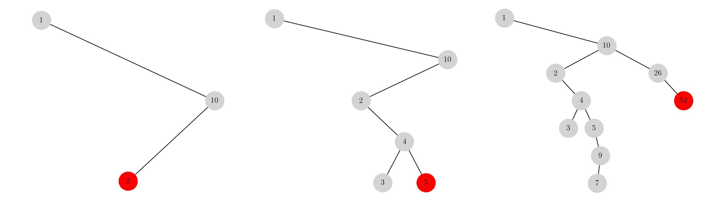
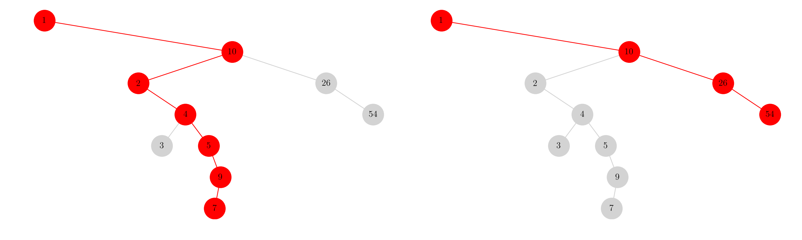
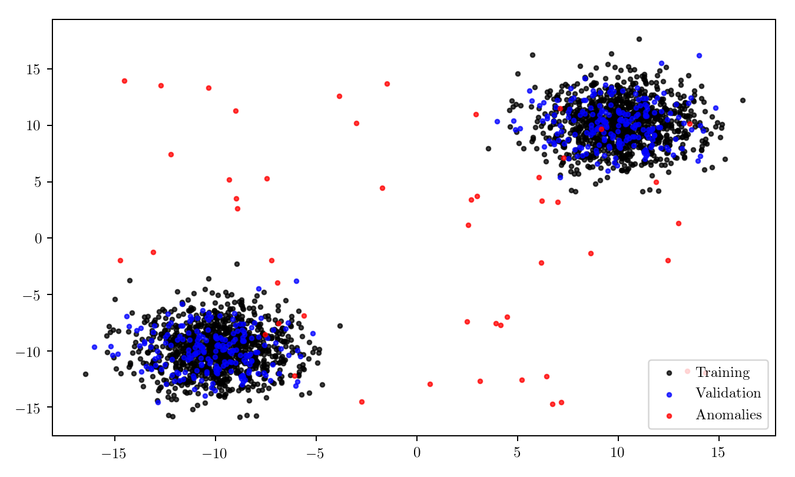
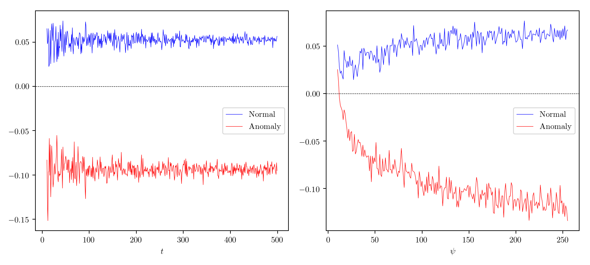
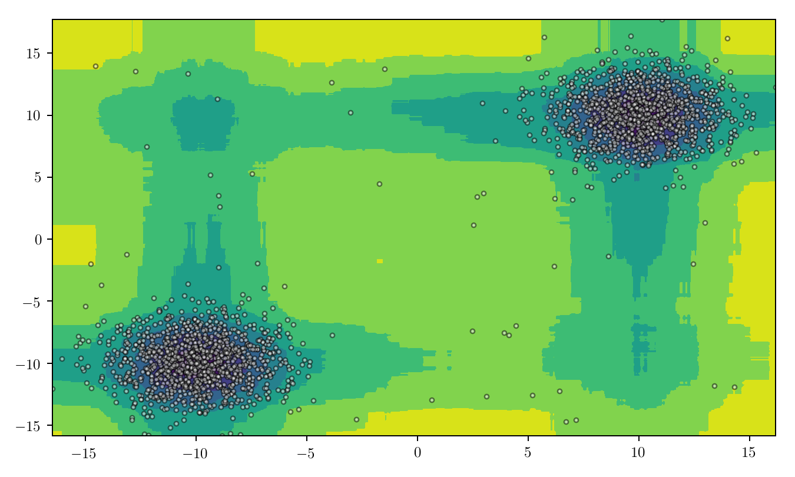
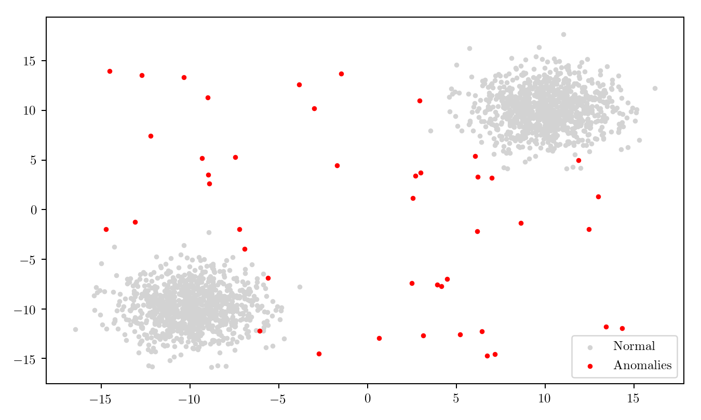

Title: Introduction to Isolation Forests
Date: 2018-10-30 21:05
Thumb: https://ruivieira.github.io/images/isolationforests/bst_steps.png

*Isolation Forests* (IFs), presented in Liu *et. al* (2012), are a popular algorithm used for outlier classification. In a very simplified way, the method consists of building an ensemble of
*Isolation Trees* (ITs) for a given data set and observations are deemed anomalies if they have short adjusted average path lengths on the ITs.

ITs, which will be covered shortly, have several properties in common with a fundamental data structure: the [Binary Search Tree](https://en.wikipedia.org/wiki/Binary_search_tree) (BSTs). In a very simplified way, BSTs are a special instance of tree structures where keys are kept in such an order that a node search is performed by iteratively (or recursively) choosing a left or right branch based on a quantitative comparison (*e.g.* lesser or greater). Node insertion is performed by doing a tree search, using the method described previously, until reaching an _external node_, where the new node will be inserted. This allows for efficient node searches since, on average, half the tree will not be visited. To illustrate this assume the values $x=[1, 10, 2, 4, 3, 5, 26, 9, 7, 54]$ and the respective insertion on a BST. The intermediate steps would then be as shown below.

One of the properties of BSTs is that, with randomly generated data, the path between the root node and the outliers will typically be shorter. We can see from the illustration below that, with our example data, the path length for (say) 7 is twice the length than for the suspicious value of 54. This property will play an important role in the IF algorithm, as we will see further on.

## Isolation Trees

Since ITs are the fundamental component of IFs, we will start by describing their building process. We start by defining $t$ as the number of trees in the IF, $\mathcal{D}$ as the training data (contained in an $n$-dimensional feature space, $\mathcal{D} \subset \mathbb{R}^n$) and $\psi$ as the subsampling size. The building of a IT consists then in recursively partitioning the data $\mathcal{D}$ by sampling (without replacement) a subsample $\mathcal{D}^{\prime}$ of size $\psi$. We then build an isolation tree $\mathcal{T}^{\prime}$ with this subsample (in order to later add it to the isolation forest $\mathcal{F}$) and the process is repeated $t$ times.

To build an isolation tree $\mathcal{T}^{\prime}$ from the subsample we proceed as follows: if the data subsample $\mathcal{D}^{\prime}$ is indivisible, a tree is returned containing a single _external node_ corresponding to the feature dimensions, $n$.  If it can be divided, a series of steps must be performed. Namely, if we consider $Q = \lbrace q_1,\dots,q_n\rbrace$ as the list of features in $\mathcal{D}^{\prime}$, we select a random feature $q \in Q$ and a random _split point_ $p$ such that
$$
\min(q) < p < \max(q), \qquad q \in Q.
$$
Based on the cut-off point $p$, we filter the features into a BST's left and right nodes according to
$$
\mathcal{D}_l := \lbrace \mathcal{D}^{\prime} : q \in Q,  q<p\rbrace \\
\mathcal{D}_r := \lbrace \mathcal{D}^{\prime} : q \in Q,  q \geq p\rbrace,
$$
and return an _internal node_ having an isolation tree with left and right nodes as respectively $\mathcal{D}_l$ and $\mathcal{D}_r$.

To illustrate this (and the general method of identifying anomalies in a two dimensional feature space, $x\in\mathbb{R}^2$) we will look at some simulated data and its processing. We start by simulating two clusters of data from a multivariate normal distribution, one centred in $x_a=[-10, 10]$ and another centred in $x_b=[10, 10]$, with a variance of $\Sigma=\text{diag}(2, 2)$, that is
$$
X_a \sim \mathcal{N}\left([-10, -10], \text{diag}(2, 2)\right) \\
X_b \sim \mathcal{N}\left([10, 10], \text{diag}(2, 2)\right).
$$
The particular realisation of this simulation looks like this:

Below we illustrate the building of a _single_ IT (given the data), illustrating the feature split point $p$ and respective division of the feature list into _left_ or _right_ IT nodes. The process is conducted recursively until the feature list is no longer divisible. As mentioned previously, this process, the creation of an IT, is repeated $t$ times in order to create the IF.



In order to perform anomaly detection (*e.g.* observation scoring) we will then use the IT equivalent of the BST unsuccessful search heuristics. An external node termination in an IT is equivalent to a BST unsuccessful search. Given an observation $x$, our goal is then to calculate the score for this observation, given our defined subsampling size, that is, $s(x,\psi)$.

This technique amounts to partitioning the feature space randomly until feature points are "isolated". Intuitively, points in high density regions will need more partitioning steps, whereas anomalies (by definition away from high density regions) will need fewer splits. Since the building of the ITs is performed in a randomised fashion and using a subsample of the data, this density predictor can be average over a number of ITs, the _Isolation Forest_.

Intuitively, this could be done by calculating the average path length for our $\mathcal{T}_n, n=1,\dots,t$ ITs, $\overline{h}(x)$. However, as pointed in Liu _et. al_ (2012), a problem with calculating this is that maximum possible height of each $\mathcal{T}_n$ grows as $\mathcal{O}(\log(\psi))$. To compare $h(x)$ given different subsampling sizes, a normalisation factor, $c(\psi)$ must be established. This can be calculated by

$$
\begin{align}
c(\psi) = \begin{cases}
2H(\psi-1)-2\frac{\psi-1}{n},&\text{if}\ \psi >2,\\
1, &\text{if}\ \psi=2,\\
0, &\text{otherwise}, 
\end{cases}
\end{align}
$$
where $H(i)$ is the harmonic number estimated by

$$
H(i)\approx\log(i) + e.
$$

Denoting $h_{max}$ as the tree height limit and e as the _current path length_, initialised as $e=0$ we can then calculate $h(x)$ recursively as:

$$
\begin{align}
h(x,\mathcal{T},h_{max},e) = \begin{cases}
h(x,\mathcal{T}_{n,left},h_{max},e+1) &\text{if}\ x_a < q_{\mathcal{T}} \\
h(x,\mathcal{T}_{n,right},h_{max},e+1) &\text{if}\ x_a \geq q_{\mathcal{T}} \\
e+c(\mathcal{T_{n,s}}) &\text{if}\ \mathcal{T} \text{is a terminal node or}\ e \geq h_{max}.
\end{cases}
\end{align}
$$

Given these quantities we can then, finally, calculate the anomaly score, $s$ as

$$
s(x,\psi) = 2^{-\frac{\text{E}[h(x)]}{c(\psi)}},
$$
with $\text{E}[h(x)]$ being the average $h(x)$ for a collection of ITs.

### Parameters

As mentioned in Liu *et. al* (2012), the empirical subsampling size $\psi=2^8$ is typically enough to perform anomaly detection in a wide range of data. Regarding the number of trees, $t$ no considerable accuracy gain is usually observed with $t>100$. In the plots below, we can see the score calculation for two point in our data, namely an outlier ($x_o=[3.10, -12.69])$ and a normal observation ($x_n=[8.65, 9.71]$) with a varying number of trees and $\psi=2^8$ (*left*) and a varying subsample size and $t=100$ (*right*). We can see that the score value stabilised quite early on when using $\psi=2^8$ and that very low subsampling sizes can lead to problems when classifying anomalies.

Now that we know how to implement an IF algorithm and calculate an anomaly score, we will try to visualise the anomaly score distribution in the vicinity of the simulated data. To do so, we simply create a two dimensional lattice enclosing our data an iteratively calculate $s(\cdot, \psi)$. The result is show below:

The above steps fully define a naive isolation forest algorithm, which when applied to the previously simulated data, result in 88% of the anomalies being correctly identified.

Thanks for reading! If you have any questions or comments, please let me know on [Mastodon](https://mastodon.social/@ruivieira) or [Twitter](https://twitter.com/ruimvieira).

---
## References
* Liu, F. T., Ting, K. M., & Zhou, Z. H. (2012). *Isolation-Based Anomaly Detection.* ACM Transactions on Knowledge Discovery from Data, 6(1), 1–39. https://doi.org/10.1145/2133360.2133363

