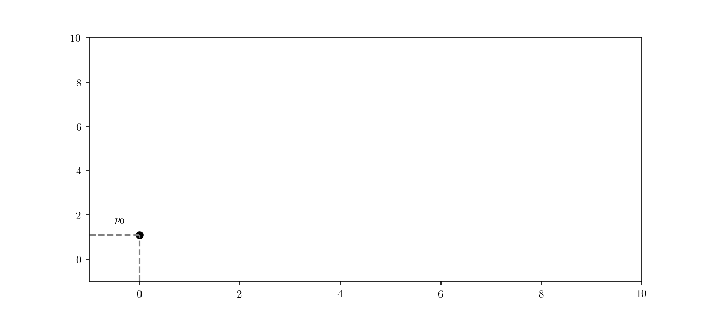

Title: Monotonic Cubic Spline interpolation (with some Rust)
Date: 2019-04-03 17:09
Category: code
Tags: code, rust, math

Monotonic Cubic Spline interpolation (MCSI) is a popular and useful method which allows to fit a smooth continuous function through discrete data. MCSI has several applications in the field of computer vision and trajectory fitting. MCSI further guarantees monotonicity of the smoothed approximation, something which a cubic spline approximation alone cannot.
In this post I’ll show how to implement the method developed by F. N. Fritsch and R. E. Carlson [[Fritsch2005](#ref-1)<a name="ref-1-origin"></a>] in the [Rust](https://www.rust-lang.org/) programming language.

## Rust
_Why_ Rust? Definitely this is a type of solution so simple that it can be implemented in  pratically any programming language we can think of. However, I do find that the best way to get acquainted with a new language and it's concepts is precisely to try to implement a simple and well-know solution. Although this post does not intend to be an introduction to the Rust language, some of the fundamentals will be presented as we go along.

Idiomatic Rust Object-Oriented Programming (OOP) has several characteristics which differ significantly from “traditional” OOP languages.
Rust achieves data and behaviour encapsulation by mean of defining data structure blueprints (called `struct`) and then defining their behaviour though a concrete implementation (through `impl`). As an example, a simple “class” `Foo` would consist of:

```rust
struct Foo {
}

impl Foo {
	fn new() -> Foo {
		return Foo {};
  }
  fn method(&mut self) {}
  fn static_method() {}
}

pub fn main() {
    let mut f = Foo::new();
    f.method();
    Foo::static_method();
}
```

The “constructor” is defined typically as `new()`, but any “static” method which returns an initialised `struct` _can_ be a constructor and “object” methods include the passing of the `self` instance not unlike languages such as Python. The `&mut self` refers to the control or exclusive access to `self` and it is not directly related to `mut` mutability control. These concepts touch on Rust's borrowing and ownership model which, unfortunately, are _way_ beyond the scope of this blog post. A nice introduction is provided by the "_Rust programming book_" available [here](https://doc.rust-lang.org/book/ch04-00-understanding-ownership.html).
Our implementation aims at building a MCSI class `MonotonicCubicSpline` by splitting the algorithm into the slope calculation at _construction_ time, a _Hermite interpolation_ function and a _partial application function generator_. This will follow the general structure

```rust
pub struct MonotonicCubicSpline {
    m_x: Vec<f64>,
    m_y: Vec<f64>,
    m_m: Vec<f64>
}

impl MonotonicCubicSpline {
	pub fn new(x : &Vec<f64>, y : &Vec<f64>) -> MonotonicCubicSpline {
  	// ...
	}
  pub fn hermite(point: f64, x : (f64, f64), y: (f64, f64), m: (f64, f64)) -> f64 {
     // ...
  }

  pub fn interpolate(&mut self, point : f64) -> f64 {
     // ...
  }

	fn partial(x: Vec<f64>, y: Vec<f64>) -> impl Fn(f64) -> f64 {
     // ...
  }
}
```

`Vec` is a vector, a typed growable collection available in Rust's standard library with documentation available [here](https://doc.rust-lang.org/std/vec/struct.Vec.html).

## Monotonic Cubic Splines

MCSI hinges on the concept of cubic Hermite interpolators. The Hermite interpolation for the unit interval for a generic interval $(x_k,x_{k+1})$ is

$$p(x)=p_k h_{00}(t)+ h_{10}(t)(x_{k+1}-x_k)m_k + h_{01}(t)p_{k+1} + h_{11}(t)(x_{k+1}-x_{k})m_{k+1}.$$

The $h_{\star}$ functions are usually called the _Hermite basis functions_ in the literature and here we will use the factorised forms of:


$$\begin{aligned}
h_{00}(t) &= (1+2t)(1-t)^2 \\
h_{10}(t) &= t(1-t)^2 \\
h_{01}(t) &= t^2 (3-2t) \\
h_{11}(t) &= t^2 (t-1).
\end{aligned}$$

This can be rewritten as

$$
p(x) = (p_k(1 + 2t) + \Delta x_k m_k  t)(1-t)(1-t) + (p_{k+1} (3 -2t) + \Delta x_k m_{k+1} (t-1))t^2
$$

where 

$$
\begin{aligned}
\Delta x_k &= x_{k+1} - x_k \\
t &= \frac{x-x_k}{h}.
\end{aligned}
$$

This associated Rust method is the above mentioned “static” `MonotonicCubicSpline::hermite()`:

```rust
pub fn hermite(point: f64, x : (f64, f64), y: (f64, f64), m: (f64, f64)) -> f64 {

    let h = x.1 - x.0;
    let t = (point - x.0) / h;
    return (y.0 * (1.0 + 2.0 * t) + h * m.0 * t) * (1.0 - t) * (1.0 - t)
        + (y.1 * (3.0 - 2.0 * t) + h * m.1 * (t - 1.0)) * t * t;
}
```

where the tuples correspond to $x \to (x_k, x_{k+1})$, $t \to (y_k, y_{k+1})$ and $m \to (m_k, m_{k+1})$

For a series of data points $(x_k, y_k)$ with $k=1,\dots,n$ we then calculate the slopes of the secant lines between consecutive points, that is:

$$\Delta_k = \frac{\Delta y_{k}}{\Delta x_k}\qquad, \text{for}\ k=1,\dots,n-1$$

with $\Delta y_k = y_{k+1}-y_k$ and $\Delta x_k$ as defined previously.



Since the data is represented by the vectors `x : Vec<f64>` and `y : Vec<f64>` we implement this in the “constructor”:

```rust
let mut secants = vec![0.0 ; n - 1];
let mut slopes  = vec![0.0 ; n];

for i in 0..(n-1) {
    let dx = *x[i + 1] - *x[i];
    let dy = *y[i + 1] - *y[i];
    secants[i] = dy / dx;
}
```

The next step is to average the secants in order to get the tangents, such that

$$m_k = \frac{\Delta_{k-1}+\Delta_k}{2}\qquad, \text{for}\ k=2,\dots,n-1$$.

This is achieved by the code:

```rust
slopes[0] = secants[0];
for i in 1..(n-1) {
    slopes[i] = (secants[i - 1] + secants[i]) * 0.5;
}
slopes[n - 1] = secants[n - 2];
```

By definition, we want to ensure monotonicity of the interpolated points, but to guarantee this we must avoid the interpolation spline to go too far from a certain radius of the control points. 
If we define $\alpha_k$ and $\beta_k$ as

$$\begin{aligned}
\alpha_k &= \frac{m_k}{\Delta_k} \\
\beta_k &= \frac{m_{k+1}}{\Delta_k},
\end{aligned}$$

to ensure the monotonicity of the interpolation we can impose the following constraint on the above quantities:

$$\phi(\alpha, \beta) = \alpha - \frac{(2\alpha+\beta-3)^2}{3(\alpha+\beta-2)}\geq 0,$$

that is

$$\alpha + 2\beta - 3 \leq 0, \text{or}\ 2\alpha+\beta-3 \leq 0$$

Typically the vector $(\alpha_k, \beta_k)$ is restricted to a circle of radius 3, that is

$$\alpha^2_l + \beta_k^2>9,$$

and then setting

$$m_{k+1} = t\beta_k\Delta_k,$$

where

$$\begin{aligned}
h &= \sqrt{\alpha^2_k + \beta^2_k} \\
t &= \frac{3}{h}.
\end{aligned}$$

One of the ways in which Rust implements polymorphism is through method dispatch. The `f64` primitive [provides](https://doc.rust-lang.org/std/primitive.f64.html#method.hypot) a shorthand for the quantity $\sqrt{\alpha^2_k + \beta^2_k}$ as $\alpha.\text{hypot}(\beta)$. The relevant Rust code will then be:

```rust
for i in 0..(n-1) {
    if secants[i] == 0.0 {
        slopes[i] = 0.0;
        slopes[i + 1] = 0.0;
    } else {
        let alpha = slopes[i] / secants[i];
        let beta = slopes[i + 1] / secants[i];
        let h = alpha.hypot(beta);
        if h > 3.0 {
            let t = 3.0 / h;
            slopes[i] = t * alpha * secants[i];
            slopes[i + 1] = t * beta * secants[i];
        }
    }
}

```

We are now able to define a “smooth function” generator using MCSI. We generate a smooth function $g(\cdot)$ given a set of $(x_k, y_k)$ points, such that

$$f(x_k, y_k, p) \to g(p).$$

## Partial application

Before anything, it is important to recall the difference between partial application and _currying_, since the two are (incorrectly) used interchangeably quite often.
_Function currying_ allows to factor functions with multiple arguments into a chain of single-argument functions, that is

$$f(x, y, z) = h(x)(y)(z)$$

The concept is prevalent in functional programming, since its initial formalisation [[Curry1958](#ref-2)<a name="ref-2-origin"></a>]. Partial application, however, generally aims at using an existing function conditioned on some argument as a basis to build functions with a reduced arity. In this case this would be useful since ultimately we want to create a smooth, continuous function based on the control points $(x_k, y_k)$. The partial application implementation is done in Rust as

```rust
pub fn partial(x: Vec<f64>, y: Vec<f64>) -> impl Fn(f64) -> f64 {
    move |p| {
        let mut spline = MonotonicCubicSpline::new(&x, &y);
        spline.interpolate(p)
    }
}
```

An example of how to generate a concrete smoothed continuous function from a set of control points can be:

```rust
let x = vec![0.0, 2.0, 3.0, 10.0];
let y = vec![1.0, 4.0, 8.0, 10.5];

let g = partial(x, y);

// calculate an interpolated point
let point = g(0.39);
```


The full code can be found [here](https://gitlab.com/ruivieira/mentat/blob/master/src/lib.rs).

## References
<a name="ref-1">[Fritsch2005]</a> Fritsch, F. N., & Carlson, R. E. (2005). Monotone Piecewise Cubic Interpolation. _SIAM Journal on Numerical Analysis_. https://doi.org/10.1137/0717021 [🔝](#ref-1-origin)

<a name="ref-2">[Curry1958]</a> Curry, Haskell; Feys, Robert (1958). Combinatory logic. I (2 ed.). Amsterdam, Netherlands: North-Holland Publishing Company. [🔝](#ref-2-origin)
