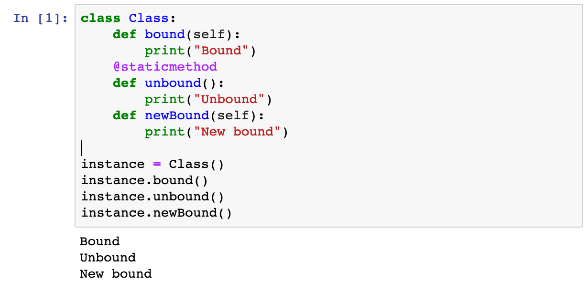
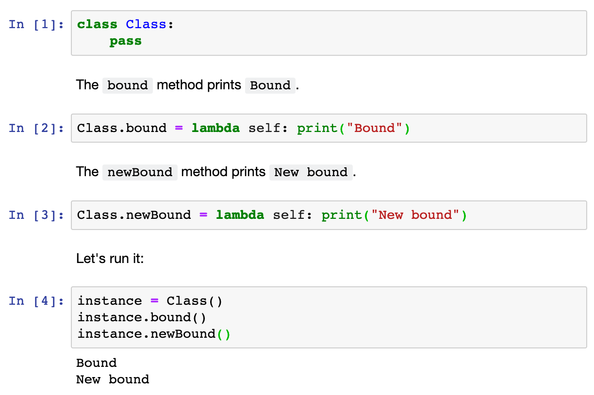

Title: Python monkey patching (for readability)
Date: 2019-02-04 17:09
Thumb: https://ruivieira.github.io/images/isolationforests/bst_steps.png


When preparing a [Jupyter](https://jupyter.org/) notebook for a workshop on recommendation engines which I’ve presented with a colleague, I was faced with the following problem:

> How to break a large class definition intro several cells so it can be presented step-by-step.

Having the ability to declare a rather complex (and large) Python class in separate cells has several advantages, the obvious one being the ability to fully document each method’s functionality with Markdown, rather than comments.

Python does allow for functionality to be added to classes after their declaration via the assignment of methods through attributes. This is commonly known as “monkey patching” and hinges on the the concepts of _bound_ and _unbound_ methods.

## Bound and unbound methods

Let’s first look at bound methods. If we assume a class called `Class` and an instance `instance`, with an instance method `bound` and class method `unbound` such that

```python
class Class:
	def bound(self):
		pass
	@staticmethod
	def unbound():
		pass

instance = Class()
```

Then `foo` is a bound method and `bar` is an unbound method.
This definition, in practice, can be exemplified by the standard way of calling `.foo()`, which is

```python
instance.bound()
```

which in turn is equivalent to

```python
Class.bound(instance)
```

The standard way of calling `unbound` is , similarly

```python
instance.unbound()
```

This, however, is equivalent to

```python
Class.unbound()
```

In the unbound case, we can see there’s no need to pass the class instance. `unbound` is _not bound_ to the class instance.

As mentioned before, Python allow us to change the class attributes at runtime. If we consider a method such as

```python
def newBound(self):
	pass
```

we can then add it to the class, even after declaring it. For instance:

```python
Class.newBound = newBound

instance = Class()
instance.newBound() # Class.newBound(instance)
```

It is interesting to note that any type of function definition will work, since functions are first class objects in Python. As such, if the method can be written as a single statement, a `lambda` could also be used, _i.e._

```python
Class.newBound = lambda self: print("I'm a lambda")
```

A limitation of the “monkey patching” method, is that attributes can only be changed at the class definition level.
As an example, although possible, it is not trivial to add the `.newBound()` method to `instance`.
A solution is to either call the descriptor methods (which allow for instance attribute manipulation), or declare the instance attribute as a `MethodType`.
To illustrate this in our case:

```python
import types
instance.newBound = types.MethodType(newBound, instance)

instance.newBound()
```

This method is precisely, as mentioned, to change attributes for a specific instance, so in this case, if we try to access the bound method from another instance `anotherInstance`, it would fail

```python
anotherInstance = Class()
anotherInstance.newBound() # fails with AttributeError
```

“Monkey patching” is usually, and rightly so, considered a code smell, due to the increased indirection and potential source of unwanted surprises.
However, having the ability to “monkey patch” classes in Python allows us to write Jupyter notebooks in a more literate, fluid way rather than presenting the user with a “wall of code”.

In our Jupyter notebook case, only for illustration purposes, the class could be broken from: 



Into:



